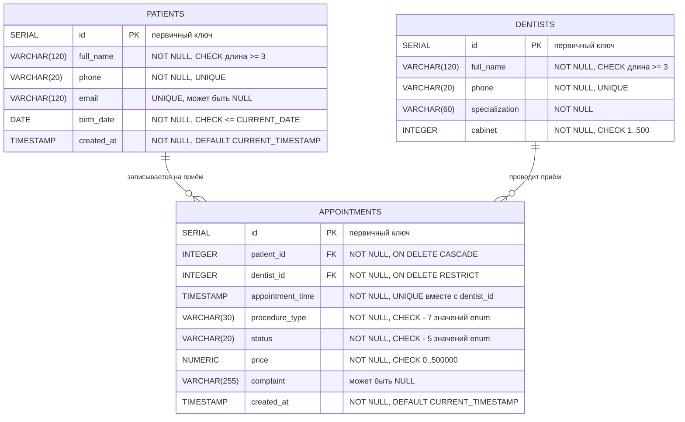

# ER-диаграмма базы данных `dental_clinic`

Информационная система «Запись пациента на стоматологический приём» (КР 1).
СУБД: PostgreSQL 13+. Готовая картинка для вставки в отчёт — `er-diagram.svg`.

## Диаграмма (Mermaid)

## Связи

| Связь | Тип | Реализация | Поведение при удалении |
|---|---|---|---|
| `appointments.patient_id` → `patients.id` | один-ко-многим (1:N) | FOREIGN KEY `fk_appointments_patient` | `ON DELETE CASCADE` — вместе с пациентом удаляется история его приёмов |
| `appointments.dentist_id` → `dentists.id` | один-ко-многим (1:N) | FOREIGN KEY `fk_appointments_dentist` | `ON DELETE RESTRICT` — врача с записями удалить нельзя |

Один пациент может иметь много записей на приём; одна запись относится
ровно к одному пациенту и одному врачу. Один врач проводит много приёмов.

## Ограничения целостности

- **PRIMARY KEY** — `patients.id`, `dentists.id`, `appointments.id` (`SERIAL`).
- **FOREIGN KEY** — два внешних ключа таблицы `appointments`.
- **NOT NULL** — все обязательные поля (ФИО, телефон, дата рождения, время приёма, процедура, статус, стоимость).
- **UNIQUE** — `patients.phone`, `patients.email`, `dentists.phone`, а также составное
  `uq_appointments_dentist_slot (dentist_id, appointment_time)`: врач не может быть занят
  двумя приёмами в одну минуту.
- **CHECK** — допустимые значения `status` и `procedure_type` (совпадают с константами
  Java-перечислений `AppointmentStatus` и `ProcedureType`), диапазон стоимости,
  диапазон номера кабинета, минимальная длина ФИО и телефона.
- **Индексы** — по времени приёма, статусу и пациенту для ускорения фильтрации и поиска.

## Соответствие таблиц и классов Java

| Таблица | Класс модели | Репозиторий | Сервис |
|---|---|---|---|
| `patients` | `model/Patient` (наследник `Person`) | `repository/PatientRepository` | `service/PatientService` |
| `dentists` | `model/Dentist` (наследник `Person`) | `repository/DentistRepository` | `service/DentistService` |
| `appointments` | `model/Appointment` | `repository/AppointmentRepository` | `service/AppointmentService` |
| колонка `status` | `model/AppointmentStatus` (enum) | — | — |
| колонка `procedure_type` | `model/ProcedureType` (enum) | — | — |
